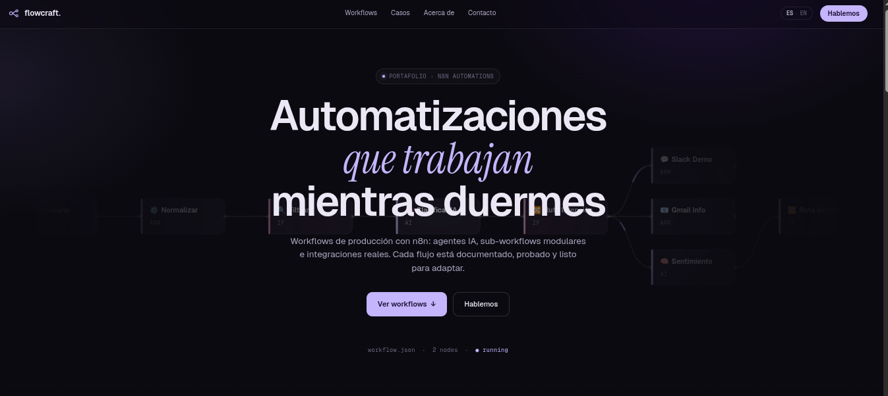
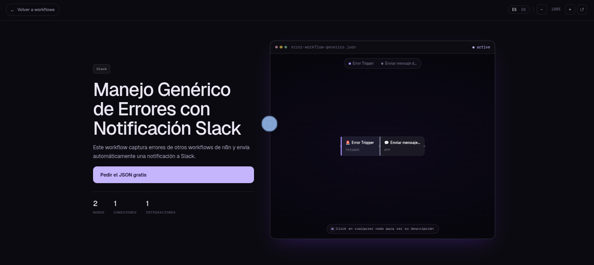
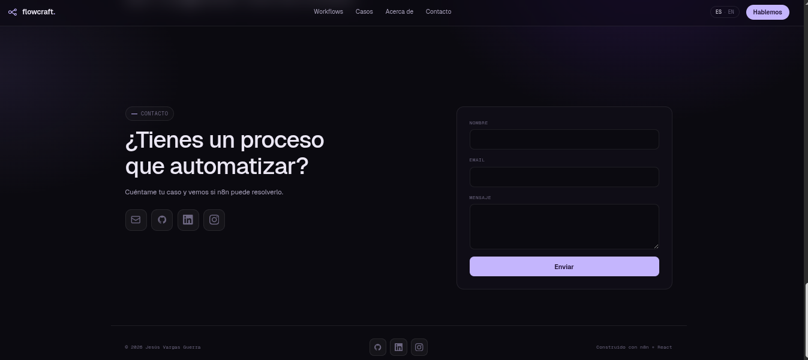
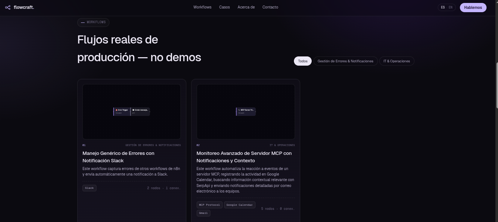

# flowcraft — n8n Workflow Portfolio

Landing page personal de **Jesús Vargas Guerra** para mostrar automatizaciones de producción construidas con [n8n](https://n8n.io/). Incluye visualización interactiva de cada workflow, panel de administración, soporte bilingüe (ES/EN) y temas de color personalizables.

---

## Previews

### Hero


### Grilla de workflows


### Detalle de workflow


### Contacto


---

## Stack

| Capa | Tecnología |
|------|-----------|
| Frontend | React 18 + Vite |
| Routing | React Router v6 |
| Backend / DB | Firebase Firestore |
| Auth | Firebase Authentication |
| Estilos | CSS puro (sin framework) |
| Deploy | Firebase Hosting |

---

## Estructura del proyecto

```
├── src/
│   ├── components/
│   │   ├── Canvas.jsx          # Canvas SVG interactivo estilo n8n
│   │   └── TweaksPanel.jsx     # Panel flotante de ajustes (densidad, acento, idioma)
│   ├── pages/
│   │   ├── Landing.jsx         # Página principal con todas las secciones
│   │   └── admin/
│   │       ├── Login.jsx       # Login del panel admin
│   │       ├── Layout.jsx      # Layout del panel admin
│   │       ├── WorkflowList.jsx
│   │       └── WorkflowForm.jsx
│   ├── hooks/
│   │   └── useAuth.js          # Hook de autenticación Firebase
│   ├── context/
│   │   └── LangContext.jsx     # Contexto de idioma
│   ├── services/
│   │   └── workflows.js        # CRUD de workflows en Firestore
│   ├── data/
│   │   └── seed.js             # Datos de workflows + strings i18n
│   ├── firebase.js             # Inicialización Firebase (usa variables de entorno)
│   ├── App.jsx                 # Router principal
│   └── index.css               # Estilos globales
├── docs/                       # Screenshots para el README
├── public/
│   └── favicon.svg
├── .env.example                # Plantilla de variables de entorno
└── firebase.json               # Configuración Firebase Hosting
```

---

## Secciones de la landing

| Sección | Descripción |
|---------|-------------|
| **Hero** | Canvas animado de fondo con el texto *"Automatizaciones que trabajan mientras duermes"*. CTAs a workflows y contacto. |
| **Work Grid** | Grilla de workflows con thumbnails de canvas SVG, filtro por categoría y contador de nodos/conexiones. |
| **Detail Page** | Vista completa: canvas interactivo (zoom a nodo, pan, flechas), descripción, cómo funciona, configuración, requisitos y workflows relacionados. CTA *"Pedir el JSON gratis"* por email. |
| **Cases** | Casos de uso reales cubiertos por los workflows. |
| **About** | Perfil + stack técnico del autor. |
| **Contact** | Formulario de contacto (Nombre, Email, Mensaje) que abre el cliente de correo + iconos de redes sociales. |
| **Footer** | © 2026 Jesús Vargas Guerra — redes sociales y créditos. |

---

## Funcionalidades del canvas

El componente `WorkflowCanvas` renderiza un grafo SVG de nodos y conexiones de cada workflow:

- Animación de flujo en tiempo real (`animated`)
- Zoom a nodo al hacer click (`selectable`)
- Pan con drag cuando está zoomed in
- Navegación con flechas del teclado (nodo anterior / siguiente)
- Hint visible: *"Click en cualquier nodo para ver su descripción"*
- Modo **thumbnail** para tarjetas del grid y sección *Más workflows* (`thumbnail`)
- Hover con highlight de los edges conectados al nodo

---

## Panel de administración

Ruta: `/admin` (requiere login con Firebase Auth)

Permite crear, editar y eliminar workflows desde una interfaz web. Los datos se guardan en Firestore y la landing los carga automáticamente, con fallback al seed local si Firebase no está configurado.

---

## Variables de entorno

Copia `.env.example` a `.env` y completa los valores:

```bash
cp .env.example .env
```

```env
VITE_FIREBASE_API_KEY=
VITE_FIREBASE_AUTH_DOMAIN=
VITE_FIREBASE_PROJECT_ID=
VITE_FIREBASE_STORAGE_BUCKET=
VITE_FIREBASE_MESSAGING_SENDER_ID=
VITE_FIREBASE_APP_ID=
VITE_ADMIN_EMAIL=
VITE_GEMINI_API_KEY=
```

> **Importante:** `.env` está en `.gitignore` y nunca debe commitearse.

---

## Instalación y desarrollo

```bash
# Instalar dependencias
npm install

# Servidor de desarrollo (localhost:5173)
npm run dev

# Build de producción
npm run build

# Preview del build
npm run preview

# Cargar seed de workflows a Firestore
npm run seed
```

---

## Deploy

El proyecto está configurado para Firebase Hosting:

```bash
npm run build
firebase deploy
```

URL de producción: [jv-flowcraft.web.app](https://jv-flowcraft.web.app)

---

## Workflows del portafolio

Los 9 workflows están documentados en la landing con canvas interactivo, descripción, integraciones y pasos de configuración:

| # | Workflow | Categoría |
|---|----------|-----------|
| 01 | Manejo Genérico de Errores con Notificación Slack | Gestión de Errores & Notificaciones |
| 02 | Monitoreo Avanzado de Servidor MCP con Notificaciones y Contexto | IT & Operaciones |
| 03 | Agente de chat con IA (OpenAI / Gemini) | IA |
| 04 | Clasificador Inteligente de Leads | CRM |
| 05 | Asistente interno — flujo principal con sub-workflows | IA |
| 06 | Chatbot conversacional (MyChatBot) | IA |
| 07 | Consultas SQL automatizadas | Datos |
| 08 | Sub-workflow: enrutado de mensajes | Utilidades |
| 09 | Sub-workflow: clasificación de mensajes | Utilidades |

---

## Contacto

**Jesús Vargas Guerra** — n8n builder & automation engineer

- GitHub: [github.com/lilseniorj](https://github.com/lilseniorj)
- LinkedIn: [linkedin.com/in/jesusvarguer18](https://www.linkedin.com/in/jesusvarguer18/)
- Instagram: [instagram.com/lilseniorj](https://www.instagram.com/lilseniorj/)
- Email: jesusvarguer18@gmail.com
